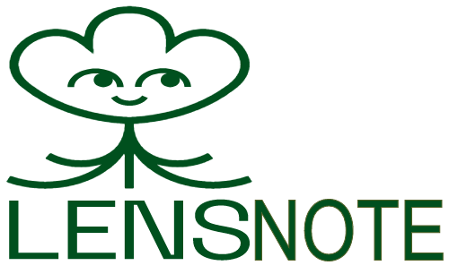

<p align="center">
  <a href="" rel="noopener">
 </a>
</p>

<h3 align="center">LensNote</h3> 
<p align="center"><a href="https://lenstube.vercel.app/">Demo Link</a></p>

---

<p align="center"> LensNote is a decentralized social network to create personal and public notes creation and sharing using Lens Protocol on Polygon's eco-friendly blockchain .
    <br> 
</p>

## 📝 Table of Contents

- [📝 Table of Contents](#-table-of-contents)
- [🧐 About <a name = "about"></a>](#-about-)
- [Getting Started <a name="started"></a>](#getting-started-)
  - [Local](#local)
- [🎈 How it's Made <a name="how"></a>](#-how-its-made-)
- [⛏️ Built Using <a name = "built_using"></a>](#️-built-using-)
- [Author <a name = "authors"></a>](#author-)
- [🤝 Contributing <a name = "contributing"></a>](#-contributing-)

## 🧐 About <a name = "about"></a>

LensNote uses Lens Protocol on top of Polygon's eco-friendly blockchain to create a social network with other technologies like web3.storage, tableland, Quicknode, and Valist to create and share personal notes which can be reacted, collected, and mirrored. Lens Protocol makes it easy to create a social network where users can create and share personal notes with everyone and also can monetize the notes users share on the platform.

## Getting Started <a name="started"></a>

### Local

First, install the requirements with `yarn` or `npm install` and then copy `.env.example` to `.env` and set the env variables there.
Then, run the development server:

```bash
npm run dev
# or
yarn dev
```

Open [http://localhost:3000](http://localhost:3000) with your browser to see LensNote.

## 🎈 How it's Made <a name="how"></a>

This project uses **Lens Protocol** to create the social network on top of **Polygon**'s eco-friendly blockchain to create and share personal notes. Users can create personal notes encrypted by **Lit Protocol** which is protected and configured to be accessible applying the different access conditions. Users can directly create a note and publish it to the lens protocol configuring conditions for collect, mirror, and comment. Personal notes encrypted by **Lit Protocol** are stored on the **IPFS & Filecoin** with **Web3.Storage** or **Tableland** based on the size of the note and the metadata for the personal note is stored on the **tableland** table. Personal notes can be updated and also published to the lens protocol whenever the user thinks it's ready to share. It uses **Quicknode** as an RPC provider. **Valist** is used to publish the static LensNote web app. LensNote uses Next.js for the frontend and node.js for creating APIs to upload metadata of notes and images to be used on the note. It uses Rainbowkit with wagmi to connect the wallet and interact with the Polygon POS blockchain easily.

## ⛏️ Built Using <a name = "built_using"></a>

- [Lens Protocol](https://lens.xyz) - Composable and Decentralized social graph
- [Web3.storage](https://web3.storage/) - Decentralized Data Storage
- [IPFS](https://ipfs.tech/) - P2P hypermedia protocol designed to preserve and grow humanity's knowledge by making the web upgradeable, resilient, and more open.
- [Filecoin](https://filecoin.io/) - Decentralized Storage network
- [Polygon](https://polygon.technology) - Blockchain
- [Tableland](https://tableland.xyz) - Permissionless relational database for web3 natives
- [Valist](https://valist.io/) - Web3-native way to Publish your Software
- [Lit Protocol](https://litprotocol.com/) - Decentralized Cryptography for Access Control, Compute, and Encryption
- [RainbowKit](https://www.rainbowkit.com/) - The best way to connect a wallet
- [Nextjs](https://nextjs.org/) - Reactjs Web Development Framework
- [Chakra UI](https://chakra-ui.com/) - A simple, modular and accessible component library.

## Author <a name = "authors"></a>

👤 **Pawan Paudel**

- Github: [@pawanpaudel93](https://github.com/pawanpaudel93)

## 🤝 Contributing <a name = "contributing"></a>

Contributions, issues and feature requests are welcome!<br />Feel free to check [issues page](https://github.com/pawanpaudel93/LensNote/issues).

Copyright © 2022 [Pawan Paudel](https://github.com/pawanpaudel93).<br />
